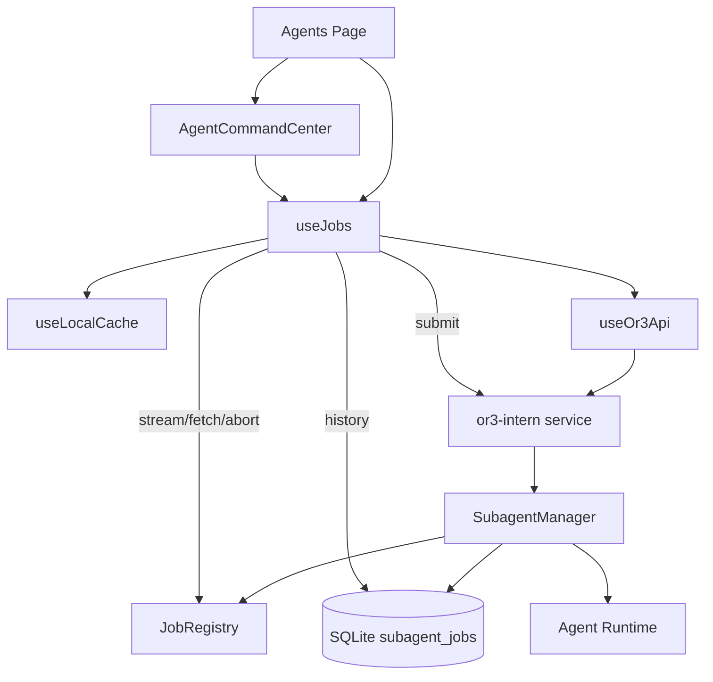

# Agents Page Functional Design

## Overview

The best path is to make `/agents` a thin, reliable client for `or3-intern` service-mode subagents. Most of the core runtime already exists: queueing, workers, database persistence, live SSE streams, snapshots, abort, approval enforcement, and capability reporting. The page is placeholder-like because the app does not yet subscribe to job streams or refresh snapshots, and the backend does not expose a durable list of persisted subagent jobs for refresh/history.

Recommended scope:

1. **Use what exists now** for submit, stream, fetch, abort, health, and capabilities.
2. **Add one small backend read endpoint** for recent persisted subagent jobs.
3. **Upgrade the frontend job store and UI** to load, track, merge, cancel, retry, and inspect jobs.

This keeps the feature simple and avoids adding a scheduler, push notification system, separate job database, or external queue.

## Research Summary

### What is already possible

`or3-intern service` already exposes the core primitives needed for a functional Agents page:

| Need                      | Current support                                      | Notes                                                |
| ------------------------- | ---------------------------------------------------- | ---------------------------------------------------- |
| Submit background task    | `POST /internal/v1/subagents`                        | Already used by `useJobs()`                          |
| Get one job snapshot      | `GET /internal/v1/jobs/{jobId}`                      | Backed by in-memory `JobRegistry`                    |
| Stream live job lifecycle | `GET /internal/v1/jobs/{jobId}/stream`               | SSE emits queued/started/tool/text/completion events |
| Abort active/queued job   | `POST /internal/v1/jobs/{jobId}/abort`               | Cancels running context or aborts queued DB job      |
| Persist subagent work     | SQLite `subagent_jobs` table                         | Stores task, status, preview, errors, timestamps     |
| Capability discovery      | `/internal/v1/health`, `/readiness`, `/capabilities` | Reports subagent manager/config state                |
| Safety enforcement        | existing auth + approval broker                      | App should not bypass it                             |

### What is missing

The gap is durable discovery. The current app only remembers jobs it created locally. The backend persists subagent jobs, but service mode does not expose a list/history route. The in-memory `JobRegistry` is not sufficient because terminal jobs are retained briefly and are lost after service restart.

Therefore, to make `/agents` fully functional without bloat, add a small read-only API over existing `subagent_jobs`:

```http
GET /internal/v1/subagents?status=running&limit=50
GET /internal/v1/subagents?limit=50
```

This endpoint should return sanitized job summaries only. Details that are already available in `subagent_jobs` are enough for the first version.

### What should stay out of v1

- Recurring monitors or scheduled tasks from the Agents page.
- Push notifications.
- Artifact browser integration.
- Multi-agent profile management.
- A second job storage system in `or3-app`.
- Broad `GET /internal/v1/jobs` for all transient job types.

True recurring monitoring can later use existing heartbeat/cron concepts, but there is no app-facing cron/heartbeat API today. The first version should avoid implying that the Monitor chip creates a persistent watcher.

## Architecture



## Backend Design

### Route additions

Add `GET /internal/v1/subagents` to the existing `handleSubagents` handler. Keep `POST /internal/v1/subagents` unchanged.

Request query parameters:

```ts
interface SubagentListQuery {
    status?:
        | 'queued'
        | 'running'
        | 'succeeded'
        | 'failed'
        | 'interrupted'
        | 'active'
        | 'terminal';
    parent_session_key?: string;
    limit?: number; // default 50, max 100
}
```

Response:

```ts
interface SubagentListResponse {
    items: PersistedSubagentJob[];
}

interface PersistedSubagentJob {
    job_id: string;
    kind: 'subagent';
    parent_session_key: string;
    child_session_key: string;
    task: string;
    status: 'queued' | 'running' | 'succeeded' | 'failed' | 'interrupted';
    result_preview?: string;
    artifact_id?: string;
    error?: string;
    requested_at: string;
    started_at?: string;
    finished_at?: string;
    updated_at: string;
}
```

Optional later route:

```http
GET /internal/v1/subagents/{jobId}
```

Do not add the detail route unless the list response proves insufficient. For v1, list plus existing job snapshot is enough.

### Database access

Add a DB method that reads existing rows only:

```go
type SubagentJobFilter struct {
    Status           string
    ParentSessionKey string
    Limit            int
}

func (d *DB) ListSubagentJobs(ctx context.Context, filter SubagentJobFilter) ([]SubagentJob, error)
```

Query behavior:

- `active` means `queued` or `running`.
- `terminal` means `succeeded`, `failed`, or `interrupted`.
- Default sort is newest first using `requested_at`/`finished_at`.
- Clamp `limit` to a small maximum.
- Return only sanitized columns; never return `metadata_json` in the API response.

### Status mapping

Backend persisted statuses should stay database-native. The frontend can normalize for display.

| Persisted status | UI status   |
| ---------------- | ----------- |
| `queued`         | `queued`    |
| `running`        | `running`   |
| `succeeded`      | `completed` |
| `failed`         | `failed`    |
| `interrupted`    | `aborted`   |

### Security

The list endpoint should use the same operator/admin authorization path as current subagent/job endpoints. It should not return:

- approval tokens
- prompt snapshots
- raw service metadata
- stack traces
- secret-bearing tool inputs or outputs

## Frontend Design

### Extend job types

Update OR3 API types:

```ts
export interface PersistedSubagentJob {
    job_id: string;
    kind: 'subagent';
    parent_session_key: string;
    child_session_key: string;
    task: string;
    status: 'queued' | 'running' | 'succeeded' | 'failed' | 'interrupted';
    result_preview?: string;
    artifact_id?: string;
    error?: string;
    requested_at: string;
    started_at?: string;
    finished_at?: string;
    updated_at: string;
}

export interface SubagentListResponse {
    items: PersistedSubagentJob[];
}
```

Extend local summaries so the UI can show meaningful labels after refresh:

```ts
export interface RecentJobSummary {
    job_id: string;
    kind: string;
    status: string;
    title: string;
    task?: string;
    category?: string;
    priority?: string;
    child_session_key?: string;
    updated_at: string;
    final_text?: string;
    error?: string;
}
```

### `useJobs()` responsibilities

Keep job state centralized in `useJobs()`.

```ts
interface UseJobsApi {
    jobs: ComputedRef<JobSnapshot[]>;
    activeJobs: ComputedRef<JobSnapshot[]>;
    loadingJobs: Ref<boolean>;
    queueJob(
        request: SubagentRequest,
        uiMeta?: AgentJobUiMeta,
    ): Promise<SubagentResponse>;
    loadJobs(options?: { status?: string; limit?: number }): Promise<void>;
    fetchJob(jobId: string): Promise<JobSnapshot>;
    subscribeJob(jobId: string): Promise<void>;
    abortJob(jobId: string): Promise<void>;
    retryJob(jobId: string): Promise<SubagentResponse | null>;
    startActiveJobTracking(): void;
    stopActiveJobTracking(): void;
}
```

Implementation details:

- On page mount, call `loadJobs()` then start tracking active jobs.
- After `queueJob()`, immediately subscribe to the returned `job_id`.
- Track at most a small number of live SSE streams, such as 3.
- Poll active jobs every 5-10 seconds only when visible and no stream is active.
- Poll/reload history less frequently, such as every 30-60 seconds.
- Stop tracking on page unmount.
- Keep local cache bounded to the newest 50-100 jobs per host.

### SSE event handling

Use the existing `api.stream()` and `readSseStream()` utilities. Convert event payloads into job updates.

Important event types observed from current backend behavior:

| Event type                | UI update                          |
| ------------------------- | ---------------------------------- |
| `queued`                  | status `queued`, child session key |
| `started`                 | status `running`                   |
| `tool_call`               | append activity row                |
| `tool_result`             | mark activity complete/error       |
| `text_delta`              | update running preview snippet     |
| `assistant`               | update final/preview text          |
| `completion`              | terminal success/abort status      |
| `error` / `runtime_error` | failed status/error message        |

### Agents page layout

Keep the current mobile-first visual style, but make the controls functional.

Sections:

1. **Command Center**
    - Task box
    - Category chips
    - Priority selector
    - Auto-approve safe intent metadata
    - Disabled/setup state when subagents are unavailable

2. **Active Jobs**
    - Queued/running jobs only
    - Live status
    - Cancel action
    - Tap for detail

3. **Queue & History**
    - Recently queued, completed, failed, aborted
    - Retry and continue-in-chat actions

4. **Job Detail Sheet**
    - Task title/body
    - Status and elapsed time
    - Timeline/activity
    - Preview/result or error
    - Cancel/retry/continue in chat

### Capability states

Use existing health/capabilities data before enabling submit:

```ts
const canSubmitAgents = computed(
    () =>
        isConnected.value &&
        health.value?.subagentManagerEnabled !== false &&
        capabilities.value?.subagentsEnabled !== false,
);
```

If capability calls fail, allow a manual retry and show connection guidance. Do not silently swallow queue errors.

## Error Handling

| Scenario                             | Behavior                                                               |
| ------------------------------------ | ---------------------------------------------------------------------- |
| Host unreachable                     | Keep local state, show reconnect message                               |
| Auth/session required                | Let existing `useOr3Api()` challenge flow handle it                    |
| Queue full `429`                     | Show queue-full message and suggest lowering concurrency/clearing jobs |
| Subagents disabled `503`             | Show setup hint linking to Agent Behavior/Advanced runtime settings    |
| Stream disconnect                    | Mark stream inactive and poll snapshot                                 |
| Job registry expired `404`           | Use persisted list item; hide live timeline                            |
| Abort conflict                       | Refresh job and show not-abortable message                             |
| Backend list unsupported `405`/`404` | Fall back to local cached jobs                                         |

## Testing Strategy

### Frontend unit tests

- `useJobs()` queues jobs and stores UI metadata.
- `useJobs()` merges persisted backend jobs with local summaries.
- Status normalization maps `succeeded` to `completed` and `interrupted` to `aborted`.
- SSE events update job status and final preview.
- Polling pauses when jobs are terminal or document is hidden.
- Abort errors do not corrupt local status.

### Backend unit tests

- DB `ListSubagentJobs()` filters by status and parent session.
- API list endpoint clamps limit and rejects invalid status.
- API list endpoint does not return `metadata_json` or approval token data.
- API list endpoint requires existing service authorization.

### Integration tests

- Queue a subagent through service API, list it, stream it, and fetch terminal status.
- Abort queued job and confirm list returns interrupted/aborted state.
- Restart service with persisted jobs and confirm list still returns history.

### Manual validation

1. Start `or3-intern service` with subagents enabled.
2. Pair/connect `or3-app`.
3. Submit a short research task from `/agents`.
4. Confirm the active job updates from queued to running to completed.
5. Refresh the browser/app and confirm the job remains in history.
6. Submit a longer task and cancel it.
7. Confirm disabled states when subagents are turned off.

## Implementation Decision

It is **partially possible with what we already have**. The current `or3-intern` service can run, stream, fetch, and abort individual background subagent jobs. To make `/agents` fully functional and robust, we should add **one small backend read endpoint** over existing persisted subagent jobs, then do most of the work in `or3-app` state management and UI.

This is the least-bloat plan because it reuses the existing runtime, DB table, service auth, approval broker, SSE stream, and app API wrapper.
