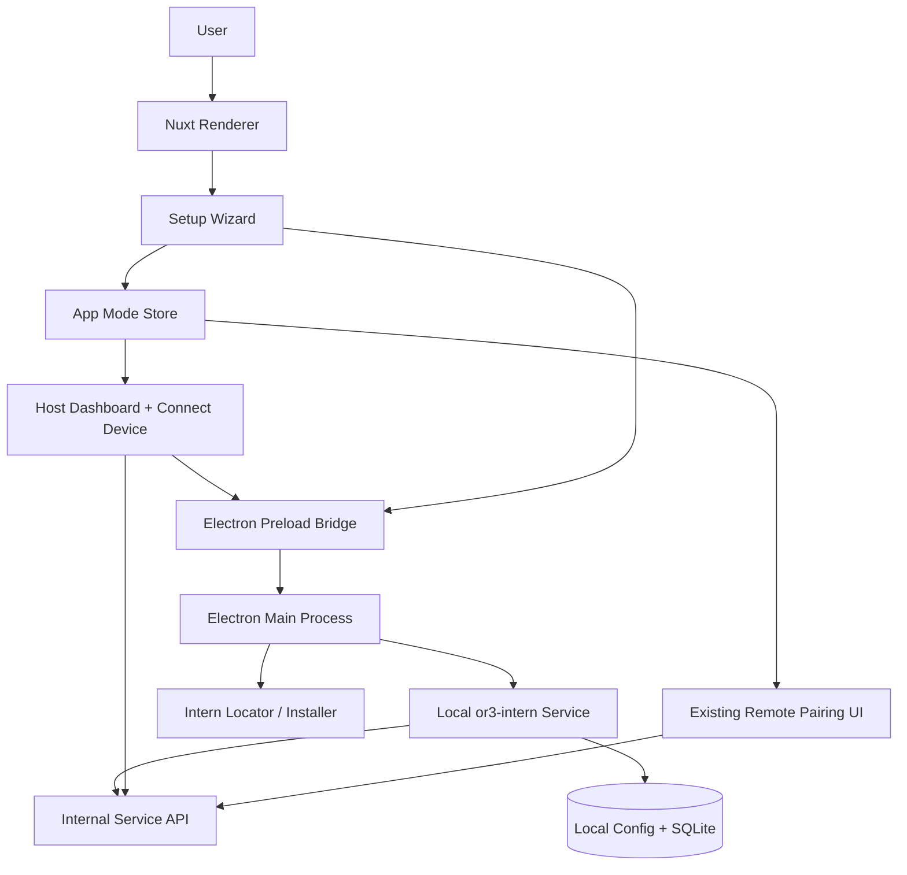

<!-- artifact_id: 62de80bb-464a-44a1-b06f-5d8dc133a9a7 -->
<!-- content_type: text/markdown -->

# Electron Host Setup Flow Design

## Overview

Electron should become a dual-role desktop app with a consumer first-run setup. The normal packaged default is not hard-coded host-only; instead, the user chooses between:

- **Use this computer**: Electron host mode. The app installs/detects `or3-intern`, starts and monitors the local service, shows local host status, and generates secure QR/device onboarding material for other devices.
- **Control another computer**: Electron remote mode. The app behaves like web/iOS/Android and connects to an existing host through the current pairing/client flow.

The implementation should preserve the existing Nuxt/Vue app and add a small platform capability layer. Electron-only features live behind explicit host-mode checks so web, iOS, Android, and Electron remote users do not see host setup or local service controls.

## Architecture



### Core Principles

1. Keep setup short: role, essentials, finish.
2. Make the recommended path safe by default: local-only service, QR enrollment, autostart opt-in or clear default.
3. Hide complexity but do not remove it: advanced fields are available behind a disclosure or advanced page.
4. Keep host mode Electron-only: never show service install/start or host QR generation on web/iOS/Android.
5. Keep remote/client mode intact: existing pairing remains available for non-host platforms and Electron remote mode.

## Components and Responsibilities

### Platform Capability Layer

Detects runtime platform and available privileged APIs.

```ts
export type Or3RuntimePlatform = 'web' | 'ios' | 'android' | 'electron';

export interface PlatformCapabilities {
    platform: Or3RuntimePlatform;
    canManageLocalService: boolean;
    canPickFolders: boolean;
    canInstallIntern: boolean;
    canManageAutostart: boolean;
    canOpenNativeLogs: boolean;
}
```

Implementation notes:

- Browser/mobile capabilities are read-only and cannot manage a local service.
- Electron capabilities come from `window.or3Desktop` exposed by `electron/preload.cjs`.
- The renderer never receives unrestricted Node or shell access.

### Setup Mode Store

Owns first-run state and role selection.

```ts
export type AppUseMode = 'undecided' | 'host' | 'remote';

export interface ElectronSetupState {
    version: 1;
    completed: boolean;
    mode: AppUseMode;
    currentStep: 'role' | 'host-essentials' | 'security' | 'starting' | 'done';
    machineName: string;
    workspaceDir?: string;
    dataDir?: string;
    securityPreset?: SecurityPresetId;
    autostartEnabled: boolean;
    serviceBehavior: 'keep-running' | 'stop-with-app';
    internBinary?: InternBinaryRef;
    serviceBaseUrl?: string;
    updatedAt: string;
}
```

Storage:

- Renderer stores non-secret setup state in localStorage initially.
- Electron main stores privileged service preferences in an app config file using Electron `app.getPath('userData')`.
- No service secret, bearer token, or private key is stored in unprotected renderer state.

### First-Run Setup Wizard

Recommended main path:

1. **What do you want OR3 to do?**
    - **Use this computer**: “Run OR3 here and connect your phone or browser.”
    - **Control another computer**: “Connect this app to OR3 running somewhere else.”
2. **Choose what OR3 can access**
    - Machine name.
    - Workspace folder via native folder picker.
    - Recommended security preset selected by default.
3. **Start OR3**
    - Detect/install `or3-intern`.
    - Apply config.
    - Start service.
    - Offer **Connect a device**.

Advanced section examples:

- Intern binary path.
- Data directory.
- Listen address and port.
- Autostart behavior.
- Service exposure policy.
- Log file location.

### Security Presets

The UI should expose three consumer choices while mapping to concrete service config.

| Preset     | User Label   | Intent                                                    | Default Config Direction                                                                           |
| ---------- | ------------ | --------------------------------------------------------- | -------------------------------------------------------------------------------------------------- |
| `private`  | Private      | Only this computer can use OR3 until you connect devices. | Listen on loopback, secure QR enabled, remote legacy disabled, approvals on, no LAN exposure.      |
| `home`     | Home network | Let approved devices on your private network connect.     | Listen on selected private interface or Tailscale, secure QR enabled, legacy hidden, approvals on. |
| `advanced` | Custom       | I know what I am changing.                                | Shows advanced fields; requires explicit confirmation for broad listen addresses.                  |

```ts
export type SecurityPresetId = 'private' | 'home' | 'advanced';

export interface SecurityPreset {
    id: SecurityPresetId;
    label: string;
    shortDescription: string;
    serviceListenMode: 'loopback' | 'private-network' | 'custom';
    allowLegacyPairing: boolean;
    preferSecureQr: boolean;
    requireApprovals: boolean;
    exposeOnLan: boolean;
}
```

### Electron Preload Bridge

Expose narrow, typed host APIs only.

```ts
export interface Or3DesktopBridge {
    platform: {
        getCapabilities(): Promise<PlatformCapabilities>;
        getSetupState(): Promise<ElectronSetupState | null>;
        saveSetupState(
            input: Partial<ElectronSetupState>,
        ): Promise<ElectronSetupState>;
    };
    filesystem: {
        pickWorkspaceDirectory(): Promise<FolderPickResult>;
        pickInternBinary(): Promise<FilePickResult>;
    };
    intern: {
        locate(): Promise<InternBinaryStatus>;
        install(): Promise<InstallProgressSummary>;
        configure(input: HostServiceConfig): Promise<ServiceConfigResult>;
        start(): Promise<ServiceStatus>;
        stop(): Promise<ServiceStatus>;
        restart(): Promise<ServiceStatus>;
        status(): Promise<ServiceStatus>;
        setAutostart(enabled: boolean): Promise<AutostartStatus>;
    };
}
```

Security rules:

- IPC channel names are allowlisted.
- Renderer sends structured inputs only, not shell command strings.
- Main process owns path validation, binary verification, process spawning, and config writes.
- Main process never exposes arbitrary filesystem reads/writes.

### Local Service Manager

Electron main owns the local service lifecycle.

```ts
export interface InternBinaryRef {
    source: 'bundled' | 'path' | 'manual';
    path: string;
    version?: string;
}

export interface HostServiceConfig {
    machineName: string;
    workspaceDir: string;
    dataDir?: string;
    listenHost: '127.0.0.1' | 'private' | string;
    listenPort: number;
    securityPreset: SecurityPresetId;
    autostartEnabled: boolean;
    serviceBehavior: 'keep-running' | 'stop-with-app';
}

export interface ServiceStatus {
    state:
        | 'not-installed'
        | 'stopped'
        | 'starting'
        | 'online'
        | 'unhealthy'
        | 'error';
    baseUrl?: string;
    version?: string;
    processId?: number;
    startedAt?: string;
    deviceCount?: number;
    health?: 'ok' | 'warning' | 'failed';
    message?: string;
}
```

Lifecycle behavior:

- Prefer bundled binary once packaging exists.
- Fall back to PATH detection for development.
- Allow manual binary selection from advanced setup.
- Start service with explicit config location and selected workspace.
- Poll health and bootstrap endpoints for status.
- Surface logs only through a controlled diagnostic viewer.

### Host Sidebar Status Card

Host-mode card replaces the current paired-remote card only in Electron host mode.

States:

- `not-installed`: **Set up OR3** action.
- `stopped`: **Start OR3** action.
- `starting`: progress indicator.
- `online`: **Connect device** primary action, service address, device count.
- `unhealthy`: **Fix setup** and **Restart** actions.

Placement:

- Bottom of `DesktopPrimarySidebar.vue`, near the existing character logo/status card.
- Keep it compact; the full details go to a host dashboard or connect-device page.

### Host Connect Device Page

Route proposal:

- `/devices/connect` or `/computer/connect-device` for host mode.
- Existing `/settings/pair` remains client/remote mode.

Primary layout:

1. Large QR area for secure enrollment.
2. Short instructions for phone/browser users.
3. Copyable service address.
4. Secondary **Use a code instead** section.
5. Hidden **Compatibility options** disclosure for legacy short-code behavior.

```ts
export interface HostDeviceInvite {
    id: string;
    kind: 'secure-qr' | 'cli-code' | 'legacy-code';
    qrText?: string;
    qrImageDataUrl?: string;
    requestId?: number;
    code?: string;
    expiresAt: string;
    serviceBaseUrl: string;
    instructions: string[];
}
```

Secure QR flow:

- Host app calls secure pairing intent endpoint.
- Host displays QR and text fallback.
- Remote device scans/pastes QR.
- Host app watches enrollment status and updates trusted-device list.

CLI fallback flow:

- Host app creates or proxies a request equivalent to `or3-intern connect-device`.
- Host app displays request ID/code and expiry.
- Remote client enters request ID/code in its client flow.

Legacy fallback flow:

- Hidden under **Compatibility**.
- Described as older short-code bearer-token pairing.
- Intended for recovery/older clients only.

### Trusted Devices Page

Host mode should rename pairing/device management around trust:

- **Trusted devices** page lists secure devices first.
- **Compatibility devices** section lists legacy tokens separately.
- Actions: refresh, revoke, rotate where supported, inspect last seen.
- Power-user commands remain documented but not required.

### Client/Remote Mode

Remote mode keeps the current client assumptions:

- Existing pairing screens.
- Existing active-host state.
- Existing Settings > Pair computer behavior, possibly renamed in remote mode to **Connect to computer**.
- No service installer, no local process controls, no host QR generation.

## Data Models

### Renderer Setup State

```ts
export interface PersistedRendererSetupState {
    version: 1;
    mode: AppUseMode;
    setupCompleted: boolean;
    currentStep?: ElectronSetupState['currentStep'];
    machineName?: string;
    workspaceDirDisplay?: string;
    securityPreset?: SecurityPresetId;
    serviceBaseUrl?: string;
}
```

### Electron Main Config

```ts
export interface ElectronHostConfigFile {
    version: 1;
    mode: 'host' | 'remote';
    internBinary?: InternBinaryRef;
    hostService?: HostServiceConfig;
    autostart?: AutostartStatus;
    lastServiceStatus?: ServiceStatus;
}
```

### Host Mode Store

```ts
export interface HostModeState {
    enabled: boolean;
    setupCompleted: boolean;
    serviceStatus: ServiceStatus;
    capabilities: PlatformCapabilities;
    activeInvite?: HostDeviceInvite;
    trustedDeviceCount?: number;
}
```

## Error Handling

### Setup Errors

Use short user-facing messages with technical detail behind **Details**.

| Scenario               | User Message                                                  | Recovery                                                                |
| ---------------------- | ------------------------------------------------------------- | ----------------------------------------------------------------------- |
| `or3-intern` not found | OR3 Intern is not installed yet.                              | Install automatically or choose a file.                                 |
| install failed         | OR3 could not finish installing the companion service.        | Retry, choose existing binary, or open logs.                            |
| workspace invalid      | OR3 cannot use that folder.                                   | Pick another folder.                                                    |
| port in use            | OR3 could not start because the service port is already busy. | Use existing service, choose another port, or stop conflicting process. |
| service unhealthy      | OR3 started, but it is not ready yet.                         | Restart, view checks, or open diagnostics.                              |
| QR creation failed     | OR3 could not create a device invite.                         | Retry after service is online.                                          |

### IPC Error Pattern

```ts
export interface DesktopResult<T> {
    ok: boolean;
    data?: T;
    error?: {
        code: string;
        message: string;
        detail?: string;
        recoverable: boolean;
    };
}
```

Main process methods should return structured errors and never raw child-process objects.

## Testing Strategy

### Unit Tests

- Platform capability detection.
- Setup state persistence and migration.
- Security preset to config mapping.
- Host/remote UI gating.
- Sidebar status card states.
- Connect-device page QR/code/legacy section visibility.

### Electron Main and Preload Tests

- IPC allowlist coverage.
- Folder picker calls use Electron dialog APIs only.
- Intern binary detection handles bundled, PATH, manual, and missing cases.
- Service lifecycle methods validate paths and avoid arbitrary shell execution.
- CSP remains compatible with packaged Nuxt output.

### Integration Tests

- First-run host setup with detected binary.
- First-run host setup with missing binary and install success.
- Install failure with manual binary fallback.
- Service start/health polling.
- Connect device QR intent creation.
- CLI fallback invite generation.
- Secure device listing and revocation.
- Remote mode uses current client pairing and hides host controls.

### End-to-End Release Checks

- Fresh packaged Electron app opens setup.
- User completes host setup with default preset.
- App starts `or3-intern` and shows Online.
- User opens **Connect device** and sees QR.
- Phone/browser client connects and appears in Trusted devices.
- User revokes the device.
- App relaunch preserves mode and service status.

## Rollout Plan

### Phase 1: Planning and Shell

- Add mode detection and setup state.
- Add Electron-only host gate.
- Add static first-run wizard screens using mocked service APIs.
- Add host sidebar card behind host mode.

### Phase 2: Desktop Bridge and Service Detection

- Expand preload with narrow setup/folder/service IPC.
- Add intern binary detection.
- Add folder picker.
- Persist host config in Electron userData.

### Phase 3: Local Service Management

- Start/stop/restart local `or3-intern` safely.
- Poll health/bootstrap.
- Add autostart support.
- Map security presets to config.

### Phase 4: Host Device Onboarding

- Add host **Connect device** page.
- Implement QR invite creation and refresh.
- Add CLI fallback generation.
- Hide legacy under compatibility.

### Phase 5: Trusted Device Management and Docs

- Rename host-mode pairing surfaces to Trusted devices.
- Add secure and legacy device lists.
- Update Electron docs and installer notes.
- Add release validation checklist.
