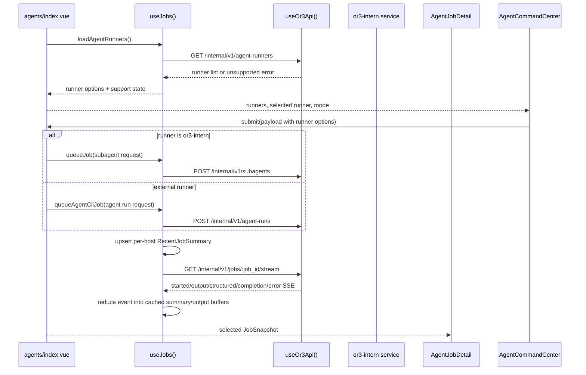

# External Agent CLI Delegation App Integration — Design

## Overview

Extend the existing `or3-app` Agents page so it can submit either current internal `or3-intern` subagent jobs or future external CLI jobs managed by `or3-intern`. The app should remain a typed API client and job viewer; it should not become a shell or runner-flag editor.

The design reuses current app surfaces:

- `app/pages/agents/index.vue` remains the orchestration page.
- `app/components/agents/AgentCommandCenter.vue` gains runner and permission-mode selection.
- `app/composables/useJobs.ts` remains the job cache, queue, SSE, polling, retry, and history hub.
- `app/types/or3-api.ts`, `app/types/app-state.ts`, and `app/utils/or3/jobs.ts` expand the normalized job model.
- `AgentActiveJobRow`, `AgentQueueHistory`, and `AgentJobDetail` render CLI jobs through the same job snapshot shape, with CLI-specific output panels.

## Affected areas

- `app/types/or3-api.ts`
  - Add runner discovery types, external run request/response types, CLI job fields, persisted CLI job types, and CLI event payload types.
- `app/types/app-state.ts`
  - Add optional runner/mode/isolation/model/cwd/stdout/stderr/raw-event fields to `RecentJobSummary`.
- `app/utils/or3/jobs.ts`
  - Normalize CLI statuses, convert persisted CLI jobs to summaries, merge CLI output fields, and identify CLI jobs.
- `app/composables/useJobs.ts`
  - Add runner discovery, `queueAgentCliJob`, external history loading, CLI SSE reducers, retry branching, and bounded output buffering.
- `app/components/agents/AgentCommandCenter.vue`
  - Add runner dropdown, mode selector, model/max-turn controls, and safe disabled explanations.
- `app/pages/agents/index.vue`
  - Fetch runners, pass runner options into the command center, branch submit routing, and update disabled copy.
- `app/components/agents/AgentJobDetail.vue`
  - Add CLI output panel, stderr filter, copy output/final result, raw events debug area, and CLI execution details.
- `app/components/agents/AgentActiveJobRow.vue`
  - Show runner-aware title/description/status copy for external CLI jobs.
- `app/components/agents/AgentQueueHistory.vue`
  - Keep existing list but improve `agent_cli:*` title/label handling.
- `app/settings/labels.ts`, `app/settings/fieldMappings.ts`, `app/settings/presets.ts`
  - Add external CLI delegation settings labels and optional controls when backend configure metadata exposes them.
- `tests/unit/jobs*.test.ts`, focused component tests if existing test setup supports them
  - Add coverage for types/utilities/composable behavior and API fallback.

## Control flow / architecture



## Data and types

### Runner discovery

Add to `app/types/or3-api.ts`:

```ts
export type AgentRunnerId = 'or3-intern' | 'opencode' | 'codex' | 'claude' | 'gemini' | string;

export type AgentRunnerStatus =
    | 'available'
    | 'missing'
    | 'not_executable'
    | 'auth_missing'
    | 'auth_unknown'
    | 'unsupported_version'
    | 'disabled_by_config'
    | 'error';

export type AgentRunnerAuthStatus = 'ready' | 'missing' | 'unknown';

export interface AgentRunnerSupports {
    structuredOutput: boolean;
    streamingJson: boolean;
    modelFlag: boolean;
    permissionsMode: boolean;
    safeSandboxFlag: boolean;
    dangerousBypassFlag: boolean;
    stdinPrompt: boolean;
    maxTurns?: boolean;
}

export interface AgentRunnerInfo {
    id: AgentRunnerId;
    display_name: string;
    binary_name?: string;
    binary_path?: string;
    version?: string;
    status: AgentRunnerStatus;
    disabled_reason?: string;
    auth_status?: AgentRunnerAuthStatus;
    supports: AgentRunnerSupports;
    default_args_preview?: string[];
}

export interface AgentRunnersResponse {
    runners: AgentRunnerInfo[];
}
```

### Submit request

```ts
export type AgentRunMode = 'review' | 'safe_edit' | 'sandbox_auto';
export type AgentRunIsolation =
    | 'host_readonly'
    | 'host_workspace_write'
    | 'sandbox_workspace_write'
    | 'sandbox_dangerous';

export interface AgentCliRunRequest {
    parent_session_key: string;
    runner_id: Exclude<AgentRunnerId, 'or3-intern'>;
    task: string;
    timeout_seconds?: number;
    cwd?: string;
    model?: string;
    mode?: AgentRunMode;
    isolation?: AgentRunIsolation;
    max_turns?: number;
    meta?: Record<string, unknown>;
}

export interface AgentCliRunResponse {
    job_id: string;
    run_id?: string;
    status: 'queued' | 'running' | string;
}
```

### Job summary extensions

Add optional fields to `RecentJobSummary` and `JobSnapshot`:

```ts
runner_id?: string;
runner_label?: string;
mode?: AgentRunMode | string;
isolation?: AgentRunIsolation | string;
model?: string;
cwd?: string;
stdout_preview?: string;
stderr_preview?: string;
output_preview?: string;
error_preview?: string;
raw_events?: unknown[];
structured_events?: unknown[];
output_truncated?: boolean;
```

Keep this additive so old cached summaries remain valid.

### Persisted CLI job mapping

If backend exposes CLI history separately:

```ts
export type PersistedAgentCliStatus =
    | 'queued'
    | 'starting'
    | 'running'
    | 'succeeded'
    | 'failed'
    | 'aborted'
    | 'timed_out';

export interface PersistedAgentCliJob {
    job_id: string;
    run_id?: string;
    kind: `agent_cli:${string}` | string;
    runner_id: string;
    parent_session_key: string;
    task: string;
    status: PersistedAgentCliStatus | string;
    requested_at: string;
    started_at?: string;
    completed_at?: string;
    updated_at: string;
    mode?: string;
    isolation?: string;
    model?: string;
    cwd?: string;
    stdout_preview?: string;
    stderr_preview?: string;
    final_text_preview?: string;
    error?: string;
    attempts?: number;
}
```

`persistedAgentCliJobToSummary(job)` should set:

- `kind: job.kind || \`agent_cli:${job.runner_id}\``
- `title: \`${displayRunner(job.runner_id)}: ${shortTask}\`` when no local title exists
- `final_text` from `final_text_preview || stdout_preview`
- `error` from `error || stderr_preview` only when failed/aborted/timed_out
- CLI-specific fields preserved for detail rendering

## Composable design

### Runner discovery in `useJobs`

Add shared refs:

```ts
const loadingRunners = ref(false);
const runnerListSupported = ref(true);
const lastRunnerError = shallowRef<Or3AppError | null>(null);
const agentRunners = shallowRef<AgentRunnerInfo[]>([]);
```

Add:

```ts
async function loadAgentRunners() {
    loadingRunners.value = true;
    lastRunnerError.value = null;
    try {
        const response = await api.request<AgentRunnersResponse>('/internal/v1/agent-runners');
        runnerListSupported.value = true;
        agentRunners.value = normalizeRunnerList(response.runners);
    } catch (error) {
        const err = error as Or3AppError;
        if (err.status === 404 || err.status === 405 || err.code === 'capability_unavailable') {
            runnerListSupported.value = false;
            agentRunners.value = [builtinInternRunner()];
            return;
        }
        lastRunnerError.value = err;
        agentRunners.value = [builtinInternRunner()];
    } finally {
        loadingRunners.value = false;
    }
}
```

Always synthesize `or3-intern` if backend omits it, so the UI default is stable.

### External submission

Add `AgentCliJobUiMeta` extending the existing `AgentJobUiMeta`:

```ts
export interface AgentCliJobUiMeta extends AgentJobUiMeta {
    runner_id: string;
    runner_label?: string;
    mode?: AgentRunMode;
    isolation?: AgentRunIsolation;
    model?: string;
    cwd?: string;
    max_turns?: number;
}
```

Add:

```ts
async function queueAgentCliJob(request: AgentCliRunRequest, uiMeta?: AgentCliJobUiMeta) {
    const response = await api.request<AgentCliRunResponse>('/internal/v1/agent-runs', { body: request });
    const nowIso = new Date().toISOString();
    upsertHostJob(cache, {
        job_id: response.job_id,
        kind: `agent_cli:${request.runner_id}`,
        status: normalizeStatus(response.status ?? 'queued'),
        title: uiMeta?.task || request.task || `${uiMeta?.runner_label || request.runner_id} task`,
        task: uiMeta?.task ?? request.task,
        updated_at: nowIso,
        created_at: nowIso,
        parent_session_key: request.parent_session_key,
        runner_id: request.runner_id,
        runner_label: uiMeta?.runner_label,
        mode: request.mode,
        isolation: request.isolation,
        model: request.model,
        cwd: request.cwd,
        category: uiMeta?.category,
        priority: uiMeta?.priority,
        notify: uiMeta?.notify,
        autoApprove: uiMeta?.autoApprove,
        source: 'live',
    });
    void subscribeJob(response.job_id);
    return response;
}
```

### History loading

Options:

1. If backend exposes separate CLI history: call `/internal/v1/agent-runs?limit=N` after `/subagents` and merge both.
2. If backend exposes a unified persisted jobs endpoint later: prefer that and keep subagent/agent-run fallbacks.

Plan for v1 app:

- Keep existing `/subagents` call.
- Add best-effort CLI history call only when runner list is supported.
- Treat CLI history 404/405 as non-fatal.

### SSE event reducer

Extend `applySseEventToCache`:

- `output`: append `payload.chunk` to `stdout_preview` or `stderr_preview` based on `payload.stream`; set status running.
- `structured`: append payload to a bounded `structured_events` list.
- `output_truncated`: set `output_truncated=true` and append a small notice.
- `completion`: map `status`, set `final_text` from `final_text_preview || stdout_preview || preview || message`; set `error` from `stderr_preview || error_message` for failed statuses.
- `error`: set failed and store safe message.

Bound cache growth:

```ts
const MAX_CACHED_CLI_OUTPUT_CHARS = 64_000;
const MAX_CACHED_STRUCTURED_EVENTS = 100;
const MAX_CACHED_RAW_EVENTS = 200;
```

Do not put unlimited live output in `useLocalCache`.

## Component design

### `AgentCommandCenter.vue`

New props:

```ts
runnerOptions?: AgentRunnerOption[];
selectedRunnerId?: string;
loadingRunners?: boolean;
runnerListSupported?: boolean;
```

New emit payload fields in `AgentTaskPayload`:

```ts
runnerId: string;
runnerLabel?: string;
mode?: AgentRunMode;
isolation?: AgentRunIsolation;
model?: string;
maxTurns?: number;
cwd?: string;
```

Add UI below the category chips or inside the settings row:

- Runner dropdown:
  - Primary section: `or3-intern`, plus external runners with `available` or `auth_unknown`.
  - Secondary expandable section: unavailable runners with reason.
- Permission mode segmented/list control:
  - `Review only`
  - `Safe workspace edits`
  - `Full autonomy in sandbox` disabled unless supported.
- Optional model input for selected runner support.
- Optional max turns for Claude/support flag.
- Compact safety copy when an external runner is selected:
  - “Runs in the background using non-interactive safe mode. It won’t wait for terminal approvals.”

Use existing `UForm`, `UDropdownMenu`, buttons, icon styling, and retro CSS; do not introduce a new styling system.

### `agents/index.vue`

Update orchestration:

- Destructure new values from `useJobs`: `agentRunners`, `loadAgentRunners`, `queueAgentCliJob`, etc.
- On mount and host change, call `loadAgentRunners()` alongside `refreshStatus()`/`loadJobs()`.
- `commandReady` should remain true when subagents are disabled but external runners are available and selected. For v1, keep a conservative disabled reason until runner selection is known; component can emit selected runner changes if page-level readiness must react.
- `createJob(payload)` branches:
  - `payload.runnerId === 'or3-intern'`: existing `queueJob` body.
  - otherwise: `queueAgentCliJob` body with typed runner fields.
- Toast descriptions should say `Task handed off to Codex` / runner label for external jobs.
- `retryJobAndClose` can remain mostly unchanged if `useJobs.retryJob` branches by cached `kind`/`runner_id`.

### `AgentJobDetail.vue`

Add computed helpers:

```ts
const isCliJob = computed(() => props.job?.kind?.startsWith('agent_cli:'));
const stdoutText = computed(() => props.job?.stdout_preview || '');
const stderrText = computed(() => props.job?.stderr_preview || '');
```

UI changes:

- Header label becomes `EXTERNAL CLI TASK` for CLI jobs.
- Quick stats mode shows runner label / mode instead of generic `Agent`.
- Hide internal tool-call section for CLI jobs unless structured events later contain mapped tool calls.
- Add `CLI OUTPUT` section:
  - filter controls: `All`, `stdout`, `stderr` or a `Show stderr only` toggle.
  - monospace scroll panel.
  - truncation notice when `output_truncated` is true.
  - `Copy output` button.
  - `Copy final result` reuses existing result copy where possible.
- Add collapsed `RAW EVENTS` section for `raw_events`/`structured_events`.
- Execution details include `Runner`, `Mode`, `Isolation`, `Model`, `CWD`, `Job ID`.

### Active/history rows

- `AgentActiveJobRow` description should prefer live output preview for CLI jobs:
  - stderr for failed jobs.
  - stdout/final text for running/completed jobs.
  - fallback `Running Codex in safe workspace edits`.
- `AgentQueueHistory` should title `agent_cli:codex` as `Codex task`, not `Agent Cli:codex`.

## Settings design

Add labels in `app/settings/labels.ts`:

- `agentCLI.enabled`: `External CLI agents`
- `agentCLI.maxConcurrent`: `External agent power`
- `agentCLI.maxQueued`: `External queue size`
- `agentCLI.defaultTimeoutSeconds`: `External task timeout`
- `agentCLI.allowSandboxAuto`: `Full autonomy in sandbox`
- `agentCLI.disabledRunners`: `Disabled external runners`

Extend automation settings only if backend configure metadata exposes these fields. Controls:

- Toggle for `agentCLI.enabled`.
- Preset slider for max concurrent/queued, separate from subagent power.
- Advanced/risk-marked toggle for `allowSandboxAuto` with copy explaining sandbox requirement.

Do not add client-only persistence of dangerous defaults in v1.

## Failure modes and safeguards

- **Older backend:** runner endpoint missing; synthesize `or3-intern`, keep existing subagent UI.
- **Runner auth missing:** disable selection and show backend-provided reason.
- **Auth unknown:** allow selection but show first-run readiness warning.
- **Backend rejects mode/isolation:** show validation error through existing `describeError` path with improved message for `validation_failed`.
- **SSE expired:** fall back to polling `/jobs/:id`; persisted output preview remains visible.
- **Large output:** truncate cached output and show truncation notice; raw events collapsed by default.
- **Dangerous mode unsupported:** disabled UI, no request sent.
- **Retry missing metadata:** existing “Not enough info to retry” behavior remains.
- **Network loss:** existing `host_unreachable` handling applies.

## Testing strategy

Use Vitest and existing mock-fetch patterns.

### Unit tests

- `useJobs.loadAgentRunners`:
  - returns backend runners.
  - synthesizes `or3-intern` when omitted.
  - falls back on 404/405.
  - marks selectable runners as `available` or `auth_unknown`.
- `queueAgentCliJob`:
  - POSTs to `/internal/v1/agent-runs` with typed body.
  - creates per-host summary with `kind=agent_cli:<runner>` and metadata.
  - starts job subscription.
- SSE reducer:
  - appends stdout and stderr output separately.
  - stores structured events boundedly.
  - handles `output_truncated`.
  - maps `timed_out` completion to failed or aborted UI vocabulary as product chooses; recommended `failed` with timeout copy.
- job utilities:
  - `isCliJob` helper.
  - persisted CLI mapping.
  - runner title formatting.
  - retry metadata preservation.
- older backend fallback:
  - `/agent-runners` unsupported does not block `queueJob` subagent submission.

### Component tests

If current test setup can mount Vue components:

- `AgentCommandCenter` renders runner dropdown and mode selector.
- unavailable runners appear in expanded section only.
- model/max-turn inputs show only with capabilities.
- sandbox auto mode is disabled with explanatory copy.
- submit payload includes selected runner fields.
- `AgentJobDetail` renders CLI output panel, stderr filter, copy buttons, and raw events section.

### Manual checks

After backend implementation is available:

- Older `or3-intern` build: agents page still works with internal subagents.
- New backend with no external binaries: runner list shows unavailable runners and internal runner remains usable.
- New backend with fake/real Codex available: submit safe edit, stream output, cancel, retry.
- CLI job after app reload: persisted history and detail preview appear.
- Mobile viewport: runner/mode controls remain touch-friendly and readable.
