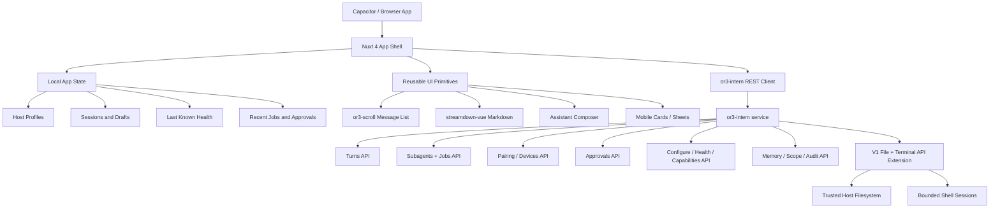
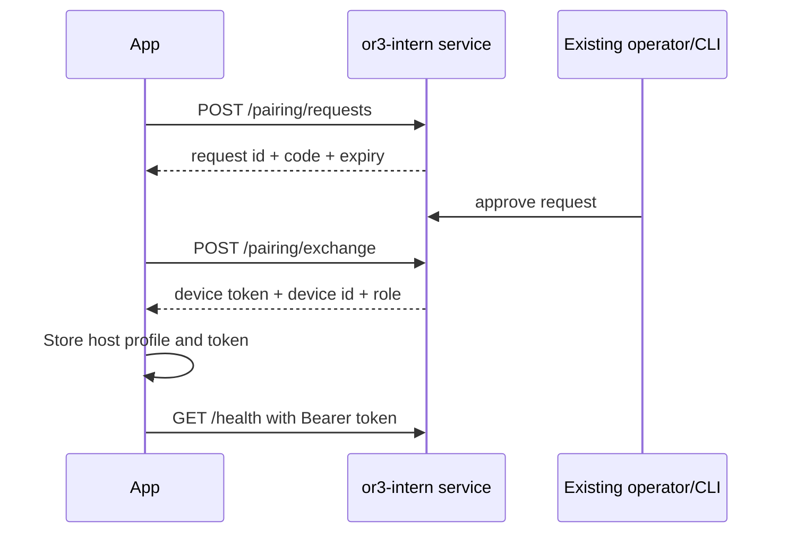

# or3-app v1 Design

## Overview

or3-app v1 is a Nuxt 4 + Capacitor app that turns `or3-intern` into a mobile-first personal AI computer controller. The app combines:

- ChatGPT-like streaming chat backed by `POST /internal/v1/turns`
- Agent job control backed by `POST /internal/v1/subagents` and job routes
- Host pairing, device management, approvals, settings, health, audit, scope, and embeddings backed by the existing `or3-intern` REST API
- File and terminal control backed by a small v1 `or3-intern` REST extension, because the current API reference does not expose direct folder/file/terminal endpoints
- Reused and improved `or3-chat` primitives: `or3-scroll@0.0.3`, `streamdown-vue@1.0.29`, composer action registry, input bridge, and the ChatInputDropper interaction model

The design prioritizes the phone as the primary device, while preserving a good desktop layout. It treats the connected computer as a private/trusted host reachable through loopback/private network/Tailscale-style access, not as a public internet service.

## Current Inputs and Reuse Inventory

### or3-app Current State

The current `or3-app` scaffold already has:

- Nuxt 4
- Vue 3
- TypeScript
- Nuxt UI
- Nuxt Icon
- Nuxt Fonts
- Capacitor config
- Android Capacitor shell

The scaffold still needs to be converted fully to Bun scripts and expanded into the real app.

### or3-chat Reuse Targets

| Existing asset | Source | v1 use |
| --- | --- | --- |
| `or3-scroll@0.0.3` | `or3-chat/package.json` | Message list bottom anchoring, scroll restoration, smooth streaming scroll behavior |
| `streamdown-vue@1.0.29` | `or3-chat/package.json` | Streaming markdown renderer for assistant messages |
| `ChatInputDropper.vue` | `or3-chat/app/components/chat/ChatInputDropper.vue` | Interaction reference for attachments, TipTap editor, send/stop states, composer actions |
| `useComposerActions.ts` | `or3-chat/app/composables/sidebar/useComposerActions.ts` | Simplified app-level action registry for attach, prompt chips, computer actions |
| `useChatInputBridge.ts` | `or3-chat/app/composables/chat/useChatInputBridge.ts` | Programmatic send bridge for quick actions, agent templates, file actions |
| Hook docs for editor extensions | `or3-chat/public/_documentation/hooks/chat-editor-extensions.md` | Optional future extensibility, not core v1 unless needed |

### Reuse Strategy

Do not copy all of `or3-chat` into `or3-app`. Instead:

1. Install and use the same working packages where useful.
2. Port only the narrow composables needed for v1: composer actions and input bridge.
3. Rebuild the composer UI as `AssistantComposer.vue` with mobile-first layout and safe-area behavior.
4. Use the ChatInputDropper implementation as a reference for hard problems: attachments, TipTap lifecycle, streaming state, and imperative API.
5. Keep copied code small, typed, and app-specific so it can later be extracted into a shared OR3 package.

## High-Level Architecture



## App Navigation

Use a mobile tab structure with one center action:

| Tab | Route | Purpose |
| --- | --- | --- |
| Chat | `/` | Main ChatGPT-like conversation surface |
| Agents | `/agents` | Background task queue and agent controller |
| Add | `/add` | Center quick-create action sheet/page |
| Computer | `/computer` | Files, terminal, host status, capabilities |
| Settings | `/settings` | Host/device/config/privacy/appearance |

Secondary screens:

- `/computer/files`
- `/computer/terminal`
- `/computer/health`
- `/approvals`
- `/settings/section/[section]`
- `/agents/[jobId]`
- `/sessions/[sessionKey]` if deep-linking is needed later

Approvals are important enough to be surfaced as:

- A badge in the bottom nav or header when pending approvals exist
- A primary card on Home/Chat when an action is waiting
- A route under Computer or Settings for full management

## Visual Design System

Use warm light theme first.

```ts
export const or3Theme = {
  background: '#F7F3EA',
  surface: '#FFFCF5',
  surfaceSoft: '#F1EADF',
  border: '#DDD4C7',
  text: '#24241F',
  textMuted: '#6F6A60',
  green: '#3F8F58',
  greenSoft: '#E1EFE4',
  greenDark: '#28623B',
  amber: '#C89232',
  danger: '#C75C5C',
  shadow: 'rgba(42, 35, 25, 0.08)',
}
```

Core UI rules:

- Use Nuxt UI for buttons, cards, inputs, switches, modals, drawers, tabs, dropdowns, badges, and toasts.
- Use Tailwind utilities for layout and exact surface styling.
- Use square icon containers to make Nuxt Icon line icons feel slightly retro.
- Use monospaced labels for command-like metadata such as `or3://chat`, `online`, `local-dev`, and `exec: ask`.
- Avoid complex decoration; use spacing and typography for polish.

Reference cues from the attached mockups should guide the first-pass UI:

- top header with a small retro computer mascot, product name, and compact online status dot
- warm off-white canvas with very subtle edge glow, not a flat gray or pure white background
- gently outlined cream cards with roomy internal spacing and almost invisible shadows
- uppercase monospace green section headers such as `RECENT TASKS`, `SYSTEM SUMMARY`, and `PINNED NOTE`
- icon containers that feel pixel-retro without turning the product into a game UI
- settings rows that look like calm iOS grouped lists, with simple chevrons and comfortable toggle spacing
- bottom navigation with a lightly emphasized center add action and strong thumb reach
- body text that stays readable and slightly monospaced in supporting metadata, without making the entire app feel like a terminal

## Directory Structure

Recommended v1 structure:

```txt
app/
  app.vue
  assets/css/main.css
  components/
    app/
      AppShell.vue
      AppHeader.vue
      BottomNav.vue
      HostStatusChip.vue
      PendingApprovalsBadge.vue
    assistant/
      AssistantComposer.vue
      ChatMessage.vue
      ChatMessageList.vue
      QuickPromptChips.vue
      StreamingMarkdown.vue
    agents/
      AgentJobCard.vue
      AgentTaskForm.vue
      JobTimeline.vue
    computer/
      ComputerOverviewCard.vue
      FileBrowser.vue
      FileBreadcrumbs.vue
      FileRow.vue
      TerminalPanel.vue
    approvals/
      ApprovalCard.vue
      ApprovalDetailSheet.vue
      AllowlistRuleRow.vue
    settings/
      SettingsGroup.vue
      SettingsRow.vue
      ConfigureField.vue
    ui/
      RetroIcon.vue
      SectionHeader.vue
      StatusPill.vue
      SurfaceCard.vue
  composables/
    useActiveHost.ts
    useOr3Api.ts
    usePairing.ts
    useChatSessions.ts
    useAssistantStream.ts
    useComposerActions.ts
    useChatInputBridge.ts
    useJobs.ts
    useApprovals.ts
    useComputerFiles.ts
    useTerminalSession.ts
    useConfigureSections.ts
    useLocalCache.ts
  pages/
    index.vue
    agents/index.vue
    agents/[jobId].vue
    add.vue
    computer/index.vue
    computer/files.vue
    computer/terminal.vue
    approvals.vue
    settings/index.vue
    settings/section/[section].vue
  types/
    or3-api.ts
    app-state.ts
```

## REST Client Design

Create a single typed API client composable. It should not embed UI logic.

```ts
export interface Or3HostProfile {
  id: string
  name: string
  baseUrl: string
  token?: string
  role?: 'operator' | 'admin'
  deviceId?: string
  lastSeenAt?: string
}

export interface Or3ApiRequestOptions {
  method?: 'GET' | 'POST' | 'PUT' | 'DELETE'
  body?: unknown
  headers?: Record<string, string>
  signal?: AbortSignal
  acceptSse?: boolean
}

export interface Or3ApiClient {
  request<T>(path: string, options?: Or3ApiRequestOptions): Promise<T>
  stream(path: string, options?: Or3ApiRequestOptions): AsyncIterable<Or3SseEvent>
}
```

Behavior:

- Resolve the active host from local state.
- Normalize base URLs with no trailing slash.
- Attach bearer token for protected routes.
- Reject insecure public HTTP by default except localhost/private-network development profiles.
- Convert `401` and `403` into typed auth errors.
- Convert `429` into typed rate-limit errors with retry metadata when available.
- Support request cancellation for chat streams, jobs, and terminal sessions.

## Core API Types

```ts
export interface TurnRequest {
  session_key: string
  message: string
  tool_policy?: ToolPolicy
  profile_name?: string
  meta?: Record<string, unknown>
}

export interface TurnResponse {
  job_id: string
  kind: 'turn'
  status: 'queued' | 'running' | 'completed' | 'failed' | 'aborted'
  final_text?: string
  error?: string
}

export interface SubagentRequest {
  parent_session_key: string
  task: string
  prompt_snapshot?: string
  tool_policy?: ToolPolicy
  timeout_seconds?: number
  profile_name?: string
  channel?: string
  reply_to?: string
  meta?: Record<string, unknown>
}

export interface JobSnapshot {
  job_id: string
  kind: string
  status: 'queued' | 'running' | 'completed' | 'failed' | 'aborted'
  created_at: string
  updated_at: string
  events?: JobEvent[]
  final_text?: string
  error?: string
}

export interface ToolPolicy {
  mode: 'allow_all' | 'deny_all' | 'allow_list' | 'deny_list'
  allowed_tools?: string[]
  blocked_tools?: string[]
}
```

## Pairing and Host Profiles

Pairing flow:



Storage:

- v1 web fallback can use local persisted storage for profiles and drafts.
- Capacitor native secure storage should be added before production distribution for bearer tokens.
- Token storage must be isolated per host profile.
- Host display should always show active host name/base URL and status.

Device management:

- `GET /internal/v1/devices` lists paired devices for the active host.
- `POST /internal/v1/devices/{deviceId}/revoke` removes a trusted device.
- `POST /internal/v1/devices/{deviceId}/rotate` rotates a paired-device token and should show/store the new token once.
- Revocation and rotation actions require confirmation because they can lock out active clients.

## Chat Design

### Message Model

```ts
export interface ChatSession {
  id: string
  hostId: string
  sessionKey: string
  title: string
  createdAt: string
  updatedAt: string
}

export interface ChatMessage {
  id: string
  sessionId: string
  role: 'user' | 'assistant' | 'system' | 'tool'
  content: string
  status: 'sending' | 'streaming' | 'complete' | 'failed'
  createdAt: string
  jobId?: string
  error?: string
}
```

### Streaming

`useAssistantStream` responsibilities:

- Append optimistic user message.
- Call `POST /internal/v1/turns` with `Accept: text/event-stream`.
- Parse SSE lifecycle events.
- Update assistant message incrementally.
- Store `job_id` for later fetch/abort.
- Fall back to JSON completion or job polling if SSE is unavailable.
- Expose `send`, `stop`, `retry`, `isStreaming`, and `activeJobId`.

Rendering:

- `ChatMessageList` uses `or3-scroll` for mobile-safe bottom anchoring.
- `StreamingMarkdown` wraps `streamdown-vue`.
- Messages should be card-like, readable, and sparse enough for mobile.

### Composer

Build `AssistantComposer.vue` as a fresh mobile component inspired by `ChatInputDropper`.

v1 composer scope:

- Multiline text input, initially plain textarea or lightweight TipTap if attachments/mentions require it
- Attach button
- Quick action row
- Send/stop button
- Desktop drop zone
- Mobile action sheet for attach/add actions
- Imperative API for `setText` and `triggerSend`

Avoid copying full desktop complexity from `ChatInputDropper` until each feature is needed.

## Agent Controller Design

`useJobs` handles:

- Queueing subagent jobs through `POST /internal/v1/subagents`
- Fetching snapshots
- Streaming job lifecycle events
- Aborting jobs
- Maintaining recent local job summaries scoped by host

Agent screens:

- `/agents`: recent jobs, create task, filters by status
- `/agents/[jobId]`: status timeline, prompt/task, output, abort/retry, related approvals

## Computer Control Design

### Existing API Coverage

Existing `or3-intern` REST API supports:

- Health and readiness
- Capabilities
- Settings/configure
- Approvals
- Audit
- Subagent/turn execution
- Scope and embeddings

It does **not** currently expose direct file browsing or interactive terminal endpoints in the documented v1 service API.

### Required v1 REST Extension

To meet the product goal, add a small computer control API to `or3-intern service`. It should follow file-portal’s local/private and root-scoped security model.

Proposed endpoints:

| Method | Path | Purpose |
| --- | --- | --- |
| `GET` | `/internal/v1/files/roots` | List configured browsable roots and labels |
| `GET` | `/internal/v1/files/list?root_id=&path=` | List a directory under a root |
| `GET` | `/internal/v1/files/stat?root_id=&path=` | Return file metadata |
| `GET` | `/internal/v1/files/download?root_id=&path=` | Download a file under root |
| `POST` | `/internal/v1/files/upload` | Upload into a directory under root |
| `POST` | `/internal/v1/files/mkdir` | Create a directory under root |
| `POST` | `/internal/v1/files/delete` | Delete or move to trash, if enabled |
| `POST` | `/internal/v1/terminal/sessions` | Create bounded shell session |
| `GET` | `/internal/v1/terminal/sessions/{id}/stream` | Stream terminal output via SSE |
| `POST` | `/internal/v1/terminal/sessions/{id}/input` | Send terminal input |
| `POST` | `/internal/v1/terminal/sessions/{id}/resize` | Resize terminal cols/rows |
| `POST` | `/internal/v1/terminal/sessions/{id}/close` | Close terminal session |

Security constraints:

- Require operator/admin auth.
- Require explicit capability/config enablement.
- Resolve every path against configured roots and reject traversal.
- Default terminal disabled unless runtime posture allows it.
- Route shell session creation through approvals when `exec` mode is `ask` or `allowlist`.
- Keep terminal sessions alive only for a bounded reconnect window.
- Add audit events for file writes/deletes/uploads/downloads and terminal session lifecycle.

### File Browser UI

`FileBrowser.vue` responsibilities:

- Root selector
- Breadcrumb navigation
- Directory list with file/folder icons
- Search/filter current directory
- Preview sheet for supported text/image/PDF metadata
- Actions: ask assistant, download/share, upload, copy path, open terminal here

### Terminal UI

`TerminalPanel.vue` responsibilities:

- Show host, cwd, approval mode, and active session status
- Render output in readable monospace blocks
- Provide command input optimized for mobile
- Support reconnect to a live session when possible
- Offer close session and clear screen actions

v1 should keep terminal UX simple and safe; full xterm emulation can come later if needed.

## Approvals Design

`useApprovals` handles:

- List pending/all approvals
- Fetch approval details
- Approve/deny/cancel
- List/remove allowlist rules
- Expire stale pending requests optionally

Approval UI:

- Pending approval cards on Home/Computer
- Full `/approvals` route
- Detail sheet with subject summary and raw JSON disclosure
- “Approve once”, “Approve and remember”, “Deny”, “Cancel” actions

Sensitive returned approval tokens should be treated as backend flow material, not as user-facing content.

## Settings Design

Settings uses existing configure endpoints.

```ts
export interface ConfigureSection {
  key: string
  label: string
  description?: string
  status?: string
}

export interface ConfigureField {
  key: string
  label: string
  kind: 'text' | 'secret' | 'bool' | 'choice' | 'list' | string
  value?: unknown
  choices?: Array<{ label: string; value: string }>
  description?: string
}

export interface ConfigureChange {
  section: string
  channel?: string
  field: string
  op: 'set' | 'toggle' | 'choose'
  value?: unknown
}
```

UI behavior:

- Group high-level app settings separately from host configuration.
- Use `ConfigureField.vue` to render fields generically.
- Require confirmation for security-sensitive changes.
- Never reveal existing secret values in plaintext.

## Local Cache and Offline State

Use a simple local storage layer first, with a clean path to Dexie if state grows.

Local state categories:

- Host profiles and active host ID
- Chat sessions and drafts
- Recent jobs and approvals summaries
- Last-known health/capabilities/readiness
- UI preferences

If tokens remain in web storage for early v1, document the limitation and prioritize a Capacitor secure storage plugin before public mobile release.

## Security Model

or3-app v1 must assume computer control is powerful.

Rules:

- Treat the `or3-intern` service as private-network/local-only.
- Prefer Tailscale/private network guidance over public exposure.
- Do not encourage public reverse proxy deployment.
- Pair devices through the existing pairing API.
- Respect `401`, `403`, capabilities, runtime profile, approval modes, and readiness warnings.
- Use approvals UI for sensitive host actions.
- File and terminal routes must be root-scoped and auditable.
- Settings changes that reduce security require confirmation.

## Error Handling

Use typed app errors.

```ts
export type Or3AppErrorCode =
  | 'host_unreachable'
  | 'auth_required'
  | 'forbidden'
  | 'rate_limited'
  | 'validation_failed'
  | 'capability_unavailable'
  | 'approval_required'
  | 'stream_failed'
  | 'file_not_found'
  | 'path_forbidden'
  | 'terminal_unavailable'
  | 'unknown'

export interface Or3AppError {
  code: Or3AppErrorCode
  message: string
  status?: number
  retryAfterMs?: number
  cause?: unknown
}
```

UI handling:

- Toast for transient errors.
- Inline error cards for failed screen loads.
- Retry buttons for network and stream errors.
- Re-pair CTA for auth failures.
- Capability explanation cards for disabled computer/terminal features.

## Testing Strategy

### Unit Tests

- REST client auth headers, base URL normalization, typed error mapping
- SSE parser and stream fallback behavior
- Pairing state transitions
- Composer action registry behavior
- Chat input bridge behavior
- Approval action payloads
- Configure change payloads

### Component Tests

- Bottom nav safe-area/active behavior
- Assistant composer send/stop/disabled states
- Chat message streaming render
- Approval detail actions
- Settings field rendering
- File browser breadcrumbs and row actions

### Integration Tests

- Pairing flow against mocked service
- Chat send with SSE stream and JSON fallback
- Agent queue/fetch/abort flow
- Approval approve/deny/cancel flow
- Configure section load/apply flow
- File list/upload/download once backend extension exists
- Terminal create/input/stream/close once backend extension exists

### E2E Tests

- First-run pair host → chat → approve command → view result
- Mobile viewport navigation across primary tabs
- Computer files browse → ask assistant about file
- Agent task creation → job detail → abort
- Settings change with confirmation

### Performance Checks

- Streaming chat should remain smooth with long responses.
- Message list should not rerender every old message on token updates.
- Polling intervals should pause or slow in background.
- Initial mobile bundle should avoid unnecessary heavy dependencies.

## V1 Scope Boundaries

### In Scope

- Mobile-first Nuxt/Capacitor app shell
- Host pairing and active host profile
- Chat turns with streaming markdown
- Agent job control
- Approvals and allowlist management
- Health/readiness/capabilities
- Settings/configure UI
- Memory/context status, embeddings, scopes
- Audit status/verify
- File browser and terminal UX with required `or3-intern` REST extension plan
- Reuse of `or3-scroll`, `streamdown-vue`, and adapted composer patterns

### Out of Scope for v1

- Multi-user cloud sync
- Public internet exposure pattern
- Full desktop IDE replacement
- Full xterm-grade terminal emulator if simple terminal panels are sufficient
- Complex plugin marketplace
- Dark mode polish beyond ensuring no hard blockers
- Full document indexing UI beyond status/rebuild and file explorer entry points
- Rebuilding all of `or3-chat` inside `or3-app`
