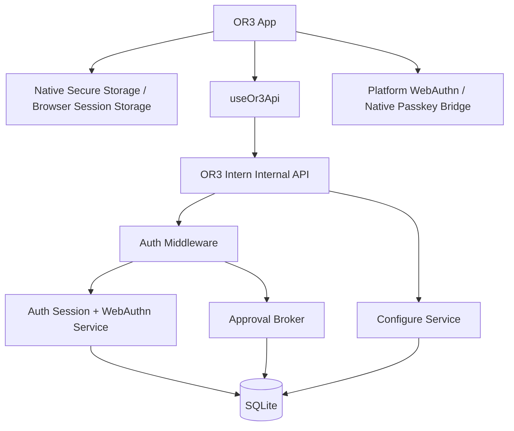

# Settings, Safety, Passkeys, Pairing, and Mobile Authentication Design

## Overview

OR3 should keep pairing as the device enrollment layer and add passkeys as the owner-presence layer. The current paired-device bearer token proves that a device was once approved; it does not prove that the owner is present now. The new model adds server-verified WebAuthn ceremonies, opaque short-lived sessions, and recent step-up checks for sensitive operations.

## Phase 1 Decisions

### Production RP ID and domain strategy

- Canonical production RP ID: `or3.chat`.
- Primary production web origins: `https://or3.chat` and `https://app.or3.chat`.
- Optional dedicated auth UI origin: `https://auth.or3.chat`, still using RP ID `or3.chat`.
- Native mobile association assets are hosted under `https://or3.chat/.well-known/` so iOS and Android can share one authoritative relying-party domain.

Deployment behavior:

| Mode | RP ID | Allowed origins | Notes |
| --- | --- | --- | --- |
| Production cloud | `or3.chat` | `https://or3.chat`, `https://app.or3.chat`, `https://auth.or3.chat` | HTTPS only, no wildcard origins |
| Local development | `localhost` | `http://localhost:*`, `https://localhost:*` | Separate credentials from production |
| HTTPS tunnel | explicit configured domain | exact configured HTTPS tunnel origin | Used for real-device testing |
| LAN / raw IP | unsupported for passkeys | none | Pairing-only unless operator provides a real HTTPS domain |
| Self-hosted | explicit operator-controlled registrable domain | exact configured HTTPS origins on that domain | Mobile passkeys require association assets on the chosen domain |

Related origins are only used when a controlled domain truly needs multiple narrow web origins. The allowlist stays explicit and small; no wildcard origin support is allowed.

### Recovery model

- Primary recovery path: local admin bootstrap via OR3 Intern CLI or local admin console access.
- Secondary recovery path: an already-paired admin device may approve recovery and re-enrollment when the instance policy allows it.
- Recovery codes are optional future support, but not the mandatory first rollout mechanism.
- The last passkey cannot be removed unless one of these recovery conditions is present:
  - local bootstrap is available, or
  - another active passkey exists, or
  - an active paired admin device is available for recovery.

If none of those conditions are true, the backend blocks removal of the final passkey.

### Native mobile passkey implementation path

- Phase 1 implementation path: standards-based WebAuthn in the secure web layer first.
- Native bridge shape is added behind a small app abstraction so iOS/Android can later swap to a first-party Capacitor plugin if WebView support proves insufficient on specific OS versions.
- Current assumption: no maintained Capacitor passkey plugin is relied on for core security.
- Secure token storage is abstracted now so native secure storage can be integrated without changing calling code.

### Route sensitivity matrix

The initial sensitivity policy is enforced by route family, with method-specific upgrades where needed.

| Route family | Classification | Notes |
| --- | --- | --- |
| `/internal/v1/health`, `/readiness`, `/capabilities`, `/auth/capabilities` | low-risk session | allowed with paired token in compatibility modes |
| `/internal/v1/pairing/requests`, `/pairing/exchange` | public pairing | pairing bootstrap path remains additive |
| `/internal/v1/auth/passkeys/login/*`, `/auth/session`, `/auth/session/revoke` | low-risk session | session establishment/refresh/logout |
| `/internal/v1/auth/passkeys/registration/*`, `/auth/passkeys*`, `/auth/step-up/*` | sensitive step-up | registration and passkey management require an authenticated owner path |
| `/internal/v1/devices`, `/devices/:id/rotate`, `/devices/:id/revoke` | sensitive step-up | listing is session-level; rotate/revoke require step-up |
| `/internal/v1/configure/*` | sensitive step-up | especially `security`, `service`, `workspace`, `tools`, `hardening`, and new `auth` settings |
| `/internal/v1/files` GET/search | low-risk session | read-only file browsing |
| `/internal/v1/files` write/upload/delete/move | sensitive step-up | file mutation requires recent verification |
| `/internal/v1/terminal/sessions*` | sensitive step-up | create/input/resize/close all require recent verification |
| `/internal/v1/approvals*` | sensitive step-up | existing broker still runs after auth succeeds |
| `/internal/v1/turns`, `/subagents`, `/jobs/*` | low-risk session | step-up only when payload requests sensitive capabilities later |
| future secret or capability-escalation routes | admin/recovery | always require session plus step-up, and may require admin role |

This design is intentionally additive:

- Existing pairing and device APIs remain the bootstrap path.
- Existing `configure` APIs remain the source of truth for settings.
- Existing approval broker policies remain in force.
- New passkey/session APIs layer on top without changing low-risk route behavior until enforcement is enabled.

## Current Architecture Findings

### OR3 App Findings

- `app/composables/useOr3Api.ts` is the central API wrapper and attaches `Authorization: Bearer ${activeHost.value.token}`.
- `app/composables/useLocalCache.ts` stores host metadata in localStorage under `or3-app:v1:state` and stores host tokens in `sessionStorage` under `or3-app:v1:host-tokens`.
- `app/composables/usePairing.ts` handles pairing request creation, code exchange, active-host verification, device listing, revocation, and token rotation.
- `app/pages/settings.vue` is a settings landing page that surfaces connection state and advanced configuration sections.
- `app/pages/settings/[section].vue` and `app/components/settings/SettingsSectionEditor.vue` expose raw configure fields.
- `app/pages/settings/pair.vue`, `app/components/app/HostConnectionCard.vue`, and `app/components/app/DeviceManagementCard.vue` already provide the device enrollment UX foundation.
- `capacitor.config.ts` defines a Capacitor app with app ID `com.or3.app`, app name `or3-app`, and `webDir: '.output/public'`.
- `package.json` currently includes Capacitor but no native passkey or secure-storage plugin.

### OR3 Intern Findings

- `cmd/or3-intern/service.go` registers internal routes under `/internal/v1/*`, including turns, subagents, jobs, pairing, devices, approvals, configure, files, terminal sessions, capabilities, health, and audit.
- `cmd/or3-intern/service_auth.go` authenticates requests through short-lived shared-secret bearer tokens or paired-device bearer tokens.
- `cmd/or3-intern/service_auth.go` includes role checks such as viewer/operator/admin but no recent passkey step-up check.
- `cmd/or3-intern/configure.go` and `cmd/or3-intern/configure_tui.go` define advanced settings sections and fields.
- `internal/config/config.go` defines security/service/session/runtime defaults and runtime profiles.
- `internal/db/db.go` includes SQLite migrations for sessions/messages/artifacts/memory/secrets/audit/paired devices/pairing/approval tables, but no passkey credential, WebAuthn ceremony, auth-session, or step-up tables.
- `internal/db/approval_store.go` provides paired-device lookup by token hash and device management persistence.
- `internal/approval/broker.go` owns pairing and approval evaluation, and should remain the policy engine for tool/file/message approvals.
- `internal/app/service_app.go` is the best facade insertion point for auth/session methods consumed by service handlers.

## Research Summary

### WebAuthn and Passkeys

- WebAuthn is a challenge-response protocol. The server must generate fresh random challenges and verify registration/authentication responses.
- The server must validate the response type, challenge, exact origin, RP ID hash, signature, user presence, and user verification when required.
- Passkeys are scoped to an RP ID, which must be a valid domain string, not a scheme/port and not an arbitrary IP address.
- WebAuthn requires secure contexts; `http://localhost` is special-cased for development.
- `userVerification: "required"` is required for OR3 step-up because `preferred` may allow responses without the UV bit.
- Credential records should include credential ID, public key, sign count, transports, backup eligibility/state, AAGUID/attestation metadata where available, timestamps, and owner linkage.
- Go backend implementation should use a maintained WebAuthn library such as `github.com/go-webauthn/webauthn` rather than custom cryptographic verification.

### Mobile Platform Constraints

- iOS native/WKWebView passkeys require Associated Domains and `webcredentials:<domain>` entitlement entries. The domain must host `https://<domain>/.well-known/apple-app-site-association` without redirects and with a valid certificate.
- Android Credential Manager passkeys require Digital Asset Links. The RP sign-in domain hosts `https://<domain>/.well-known/assetlinks.json` with relations including `delegate_permission/common.get_login_creds`; app signing fingerprints must be listed.
- Android App Links verification and Digital Asset Links propagation can be cached/delayed, so release and debug fingerprints need explicit entries.
- Related Origin Requests can allow multiple web origins to use the same RP ID by serving `https://<rpId>/.well-known/webauthn`, but support is not universal and the allowlist must remain narrow.
- Current Capawesome passkey plugin URLs checked during research returned 404. Treat native passkey plugin choice as a required implementation spike.
- Biometric-only Capacitor plugins can improve local convenience and secure storage, but plugin docs themselves warn that local biometric verification can be bypassed on rooted/jailbroken devices and must not replace server-side passkey verification.

## Architecture



### Authentication Layers

1. **Pairing token:** long-lived enrollment secret proving the device was approved.
2. **Passkey credential:** phishing-resistant owner credential registered to an RP ID and verified by OR3 Intern.
3. **Auth session token:** short-lived opaque bearer token issued after successful passkey login.
4. **Step-up grant:** recent-auth timestamp/claim inside the server session required for high-risk actions.
5. **Approval broker:** existing decision layer for tool/file/message approvals; still applies after step-up.

## Recommended Simple Settings IA

### Top-Level Settings

1. **Connection**
   - Active Intern host
   - Pair a device
   - Device status
   - Reconnect/verify host

2. **Security**
   - Passkeys
   - Require passkey on app open
   - Require passkey for sensitive actions
   - Session timeout
   - Paired devices
   - Recovery options

3. **Safety**
   - Approval mode
   - Tool execution safety
   - File access safety
   - Terminal access safety
   - Max service capability

4. **Agent Behavior**
   - Provider/model defaults
   - Runtime profile
   - History/memory depth
   - Subagent enablement and concurrency

5. **Knowledge**
   - Document indexing
   - Workspace scope
   - Memory/search tuning

6. **Advanced**
   - Existing configure section list
   - Raw field editor
   - Export diagnostics

### Existing Configure Field Mapping

| Simple Setting | Current Backend Section | Existing Field Direction |
| --- | --- | --- |
| Runtime profile | `runtime` / `hardening` | `runtime_profile` or hardened profile fields in `configure_tui.go` |
| Approval mode | `security` | `security_approval_*` fields |
| Service enabled | `service` | `service_enabled` |
| Service listen address | `service` | `service_listen` |
| Shared secret | `service` | `service_secret` |
| Pairing policy | `service` / `security` | `service_allow_unauthenticated_pairing` plus pairing route policy |
| Max service capability | `service` | `service_max_capability` equivalent field from config |
| Workspace restriction | `workspace` | `workspace_restrict`, `workspace_dir`, `workspace_allowed_dir` |
| Tool execution | `tools` | `tools_*` fields |
| History depth | `runtime` | `runtime_history_max` |
| Memory retrieval | `runtime` | `runtime_memory_retrieve`, `runtime_vector_k`, `runtime_fts_k`, `runtime_vector_scan_limit` |
| Subagents | `runtime` | `runtime_subagents_*` |
| Document index | `docindex` | `docindex_*` |
| Skills | `skills` | `skills_*` |

New passkey/session settings should be added to OR3 Intern config rather than encoded only in the app.

## Backend Components

### AuthConfig

```go
type AuthConfig struct {
    PasskeysEnabled bool
    PasskeyMode string // off | warn | enforce
    RPID string
    RPOrigins []string
    RelatedOrigins []string
    SessionIdleTTL time.Duration
    SessionAbsoluteTTL time.Duration
    StepUpTTL time.Duration
    RequirePasskeyForSensitive bool
    AllowPairedTokenFallback bool
}
```

### AuthService

```go
type AuthService interface {
    BeginPasskeyRegistration(ctx context.Context, req BeginRegistrationRequest) (PublicKeyCredentialCreationOptionsJSON, error)
    FinishPasskeyRegistration(ctx context.Context, req FinishRegistrationRequest) (PasskeyCredentialRecord, error)
    BeginPasskeyLogin(ctx context.Context, req BeginLoginRequest) (PublicKeyCredentialRequestOptionsJSON, error)
    FinishPasskeyLogin(ctx context.Context, req FinishLoginRequest) (AuthSessionRecord, error)
    BeginStepUp(ctx context.Context, sessionID string, reason StepUpReason) (PublicKeyCredentialRequestOptionsJSON, error)
    FinishStepUp(ctx context.Context, req FinishStepUpRequest) (StepUpGrant, error)
    ValidateSession(ctx context.Context, token string) (AuthSessionClaims, error)
    RevokeSession(ctx context.Context, sessionID string, reason string) error
    RevokeDeviceSessions(ctx context.Context, deviceID string, reason string) error
}
```

### StepUpPolicy

```go
type StepUpPolicy interface {
    RequiresStepUp(route ServiceRoute, method string, actor ServiceActor, payloadMeta RequestMetadata) StepUpRequirement
}

type StepUpRequirement struct {
    Required bool
    Reason string
    MaxAge time.Duration
}
```

Initial step-up routes should include:

- Device token rotation/revocation for admin devices.
- Configure apply for `security`, `hardening`, `service`, `workspace`, `tools`, and future auth sections.
- Terminal session creation and terminal write/send routes.
- File write/delete/move/upload routes.
- Approval allowlist changes.
- Secret reads/writes if exposed.
- Any action that raises max capability, enables broader workspace scope, enables terminal/tools, or disables approvals.

## Backend API Design

### Capability Discovery

`GET /internal/v1/auth/capabilities`

```ts
interface AuthCapabilitiesResponse {
  passkeysEnabled: boolean
  passkeyMode: 'off' | 'warn' | 'enforce'
  rpId?: string
  origins: string[]
  webauthnAvailable: boolean
  sessionRequired: boolean
  stepUpRequiredForSensitive: boolean
  secureStorageRecommended: boolean
  fallbackPolicy: 'paired-token-only' | 'paired-token-plus-warning' | 'admin-recovery-only'
}
```

### Registration

`POST /internal/v1/auth/passkeys/registration/begin`

```ts
interface BeginPasskeyRegistrationRequest {
  deviceId: string
  displayName: string
  attestation?: 'none' | 'direct' | 'enterprise'
}
```

`POST /internal/v1/auth/passkeys/registration/finish`

```ts
interface FinishPasskeyRegistrationRequest {
  ceremonyId: string
  credential: PublicKeyCredentialJSON
  nickname?: string
}
```

### Login and Session

`POST /internal/v1/auth/passkeys/login/begin`

```ts
interface BeginPasskeyLoginRequest {
  deviceId?: string
  usernameHint?: string
  mediation?: 'modal' | 'conditional'
}
```

`POST /internal/v1/auth/passkeys/login/finish`

```ts
interface FinishPasskeyLoginRequest {
  ceremonyId: string
  credential: PublicKeyCredentialJSON
}

interface FinishPasskeyLoginResponse {
  sessionToken: string
  expiresAt: string
  idleExpiresAt: string
  stepUpUntil?: string
  user: {
    id: string
    displayName: string
  }
}
```

`GET /internal/v1/auth/session`

`POST /internal/v1/auth/session/revoke`

### Step-Up

`POST /internal/v1/auth/step-up/begin`

```ts
interface BeginStepUpRequest {
  reason: 'configure' | 'terminal' | 'files' | 'devices' | 'approvals' | 'secrets' | 'other'
  target?: string
}
```

`POST /internal/v1/auth/step-up/finish`

```ts
interface FinishStepUpResponse {
  stepUpUntil: string
  method: 'passkey'
  credentialId: string
}
```

### Passkey Management

`GET /internal/v1/auth/passkeys`

`PATCH /internal/v1/auth/passkeys/:id`

`DELETE /internal/v1/auth/passkeys/:id`

### Error Contract

Sensitive routes should return structured errors rather than generic 401/403 when step-up is needed.

```ts
interface AuthChallengeError {
  code: 'SESSION_REQUIRED' | 'PASSKEY_REQUIRED' | 'STEP_UP_REQUIRED' | 'SESSION_EXPIRED' | 'AUTH_UNSUPPORTED'
  message: string
  challenge?: {
    reason: string
    beginUrl: string
    retryable: boolean
    maxAgeSeconds?: number
  }
}
```

## Data Model and Migrations

Add migrations in `internal/db/db.go` or split auth migrations into a dedicated file called by the DB migrator.

### `auth_users`

OR3 Intern currently appears single-owner/local-first. Add an explicit owner record to avoid tying WebAuthn user handles to mutable display names.

```sql
CREATE TABLE IF NOT EXISTS auth_users (
  id TEXT PRIMARY KEY,
  display_name TEXT NOT NULL,
  created_at TEXT NOT NULL,
  updated_at TEXT NOT NULL,
  disabled_at TEXT
);
```

### `passkey_credentials`

```sql
CREATE TABLE IF NOT EXISTS passkey_credentials (
  id TEXT PRIMARY KEY,
  user_id TEXT NOT NULL,
  device_id TEXT,
  credential_id BLOB NOT NULL UNIQUE,
  public_key BLOB NOT NULL,
  sign_count INTEGER NOT NULL DEFAULT 0,
  transports TEXT,
  aaguid TEXT,
  attestation_type TEXT,
  backup_eligible INTEGER NOT NULL DEFAULT 0,
  backup_state INTEGER NOT NULL DEFAULT 0,
  user_verified_required INTEGER NOT NULL DEFAULT 1,
  nickname TEXT,
  created_at TEXT NOT NULL,
  last_used_at TEXT,
  revoked_at TEXT,
  revoked_reason TEXT,
  FOREIGN KEY(user_id) REFERENCES auth_users(id),
  FOREIGN KEY(device_id) REFERENCES paired_devices(id)
);

CREATE INDEX IF NOT EXISTS idx_passkey_credentials_user ON passkey_credentials(user_id);
CREATE INDEX IF NOT EXISTS idx_passkey_credentials_device ON passkey_credentials(device_id);
```

### `webauthn_ceremonies`

```sql
CREATE TABLE IF NOT EXISTS webauthn_ceremonies (
  id TEXT PRIMARY KEY,
  type TEXT NOT NULL,
  user_id TEXT,
  device_id TEXT,
  challenge_hash TEXT NOT NULL,
  session_data_json TEXT NOT NULL,
  rp_id TEXT NOT NULL,
  origin TEXT,
  reason TEXT,
  created_at TEXT NOT NULL,
  expires_at TEXT NOT NULL,
  consumed_at TEXT,
  failed_at TEXT,
  failure_reason TEXT
);

CREATE INDEX IF NOT EXISTS idx_webauthn_ceremonies_expiry ON webauthn_ceremonies(expires_at);
```

Store full WebAuthn library `SessionData` server-side. Never trust client-provided ceremony/session data.

### `auth_sessions`

```sql
CREATE TABLE IF NOT EXISTS auth_sessions (
  id TEXT PRIMARY KEY,
  user_id TEXT NOT NULL,
  device_id TEXT,
  token_hash TEXT NOT NULL UNIQUE,
  role TEXT NOT NULL,
  created_at TEXT NOT NULL,
  last_seen_at TEXT NOT NULL,
  idle_expires_at TEXT NOT NULL,
  absolute_expires_at TEXT NOT NULL,
  revoked_at TEXT,
  revoked_reason TEXT,
  last_step_up_at TEXT,
  last_step_up_credential_id TEXT,
  last_step_up_reason TEXT,
  user_agent_hash TEXT,
  remote_addr_hash TEXT,
  FOREIGN KEY(user_id) REFERENCES auth_users(id),
  FOREIGN KEY(device_id) REFERENCES paired_devices(id)
);

CREATE INDEX IF NOT EXISTS idx_auth_sessions_user ON auth_sessions(user_id);
CREATE INDEX IF NOT EXISTS idx_auth_sessions_device ON auth_sessions(device_id);
CREATE INDEX IF NOT EXISTS idx_auth_sessions_expiry ON auth_sessions(idle_expires_at, absolute_expires_at);
```

### `auth_recovery_codes`

```sql
CREATE TABLE IF NOT EXISTS auth_recovery_codes (
  id TEXT PRIMARY KEY,
  user_id TEXT NOT NULL,
  code_hash TEXT NOT NULL UNIQUE,
  created_at TEXT NOT NULL,
  used_at TEXT,
  revoked_at TEXT,
  FOREIGN KEY(user_id) REFERENCES auth_users(id)
);
```

Recovery may also be implemented as a local-admin bootstrap command instead of user-visible codes, but the plan should pick one before enforcement.

## Frontend Components and Composables

### New Composables

```ts
interface UseAuthSessionReturn {
  capabilities: Ref<AuthCapabilitiesResponse | null>
  session: Ref<AuthSessionState | null>
  loadCapabilities: () => Promise<void>
  beginPasskeyLogin: () => Promise<PublicKeyCredentialRequestOptionsJSON>
  finishPasskeyLogin: (credential: PublicKeyCredential) => Promise<void>
  logout: () => Promise<void>
  ensureStepUp: (reason: StepUpReason, target?: string) => Promise<void>
}
```

Recommended files:

- `app/composables/useAuthSession.ts`
- `app/composables/usePasskeys.ts`
- `app/composables/useSecureHostTokens.ts`
- `app/utils/auth/webauthn.ts`
- `app/types/auth.ts`

### Secure Storage Strategy

1. Browser development: continue using `sessionStorage`, but mark as lower assurance.
2. Native mobile: introduce secure storage for paired-device enrollment token and session token.
3. Local biometric plugin: optional convenience to unlock secure storage; not an auth boundary.
4. Server passkey proof: required for session creation and step-up.

The app should migrate token access behind `useSecureHostTokens.ts` so `useLocalCache.ts` no longer directly owns all token persistence details.

### API Wrapper Changes

`useOr3Api.ts` should support two token classes:

1. `Authorization: Bearer <sessionToken>` when an auth session exists.
2. `X-OR3-Pairing-Token` or current bearer fallback for bootstrap routes until backend supports a cleaner split.

For backward compatibility, the first implementation can keep `Authorization: Bearer <token>` but represent active credentials internally as:

```ts
interface HostCredentials {
  pairedDeviceToken?: string
  sessionToken?: string
  sessionExpiresAt?: string
  stepUpUntil?: string
}
```

### Settings UI Changes

Recommended files:

- `app/pages/settings.vue`: promote simple categories and security status cards.
- `app/pages/settings/security.vue`: new security dashboard.
- `app/pages/settings/passkeys.vue`: passkey management.
- `app/components/settings/SecurityOverviewCard.vue`
- `app/components/settings/PasskeyList.vue`
- `app/components/settings/PasskeyRegistrationCard.vue`
- `app/components/settings/SessionPolicyCard.vue`
- `app/components/settings/SafetyPresetCard.vue`

## Security Model

### Token Rules

- Paired-device tokens are enrollment/bootstrap tokens.
- Session tokens are opaque, random, high-entropy, server-side hashed, idle-expiring, absolute-expiring, and revocable.
- Step-up state is server-side session metadata, not a client flag.
- Raw tokens are never logged; use salted hashes or session IDs in audit events.

### RP ID Recommendations

Preferred production design:

- RP ID: `or3.chat` or `auth.or3.chat`, depending on final domain ownership and deployment UX.
- Production OR3 App origin: HTTPS under the same registrable domain or explicit related origin.
- Mobile app association:
  - iOS: `webcredentials:<rp-domain>` entitlement and `apple-app-site-association` file.
  - Android: `assetlinks.json` with release/debug fingerprints and `delegate_permission/common.get_login_creds`.

Development design:

- Local web: `http://localhost:<port>` with RP ID `localhost` for dev credentials only.
- LAN/IP: do not support raw IP passkeys as a default. Require HTTPS tunnel/custom domain if passkeys are required.
- Custom self-hosted domain: allow explicit RP ID and origin config, with warnings if mobile app association cannot be satisfied.

### Enforcement Modes

1. `off`: pairing-only behavior.
2. `warn`: compute and report missing passkey/session/step-up but do not block.
3. `enforce-sensitive`: require step-up for sensitive routes only.
4. `enforce-session`: require passkey session for all non-pairing internal API routes.

Start with `off` default and expose guided setup.

## Error Handling

- Expired ceremony: return `AUTH_CEREMONY_EXPIRED`; app restarts ceremony.
- Challenge mismatch: return `AUTH_CHALLENGE_INVALID`; audit failed attempt.
- Origin mismatch: return `AUTH_ORIGIN_INVALID`; audit high severity.
- RP ID mismatch: return `AUTH_RP_INVALID`; audit high severity.
- Unknown credential: return `AUTH_CREDENTIAL_UNKNOWN`; app may call WebAuthn Signal API if supported.
- UV missing: return `AUTH_USER_VERIFICATION_REQUIRED`; app retries with `userVerification: "required"` only if backend policy allows.
- Session expired: return `SESSION_EXPIRED`; app clears session token and prompts passkey login.
- Step-up required: return `STEP_UP_REQUIRED`; app prompts and retries original action.
- Secure storage unavailable: app flags degraded storage and shortens session behavior.

## Testing Strategy

### Unit Tests

- WebAuthn ceremony lifecycle: begin, finish, consume-once, expiry, replay rejection.
- Session token hashing, lookup, idle expiry, absolute expiry, revocation.
- Step-up policy matrix for routes/methods/roles.
- Device revocation invalidates sessions.
- Config validation for RP ID/origins/modes.
- Simple setting mappings to existing configure fields.

### Integration Tests

- Pair device -> register passkey -> login -> call low-risk route.
- Sensitive route returns `STEP_UP_REQUIRED` -> finish step-up -> retry succeeds.
- Existing paired-token client works in `off` and `warn` modes.
- Old client receives structured upgrade errors in enforcement mode.
- Revoked passkey and revoked device invalidate sessions.

### E2E / Mobile Tests

- Browser WebAuthn with dev virtual authenticator where possible.
- iOS Associated Domains validation and WebView/native passkey registration.
- Android Digital Asset Links validation, debug/release fingerprints, Credential Manager/WebView behavior.
- Secure storage migration and logout/revoke cleanup.
- Offline/reconnect behavior with expired sessions.

## Backward Compatibility

- Keep existing `/internal/v1/pairing/*` and `/internal/v1/devices` behavior.
- Keep accepting paired-device bearer tokens for low-risk routes while passkey mode is `off` or `warn`.
- Do not migrate existing paired-device records destructively.
- Add new auth tables independently.
- Add capability discovery so newer app versions can adapt to older backends.
- Return structured errors for older clients instead of ambiguous 401/403.

## Rollout Plan

1. Add backend config/schema/capabilities with passkeys disabled.
2. Add sessions and token abstraction with pairing-only compatibility.
3. Add WebAuthn registration/login behind feature flag.
4. Add app security/passkey UI and secure storage abstraction.
5. Add step-up policy in warn mode.
6. Add enforcement for a small sensitive route set.
7. Expand route coverage and add recovery flow.
8. Enable guided setup and mobile association assets for production domains.

## Open Questions

1. Multi-user OR3 Intern ownership is still a follow-up design question; the first implementation assumes a single local owner record with role-scoped sessions.
